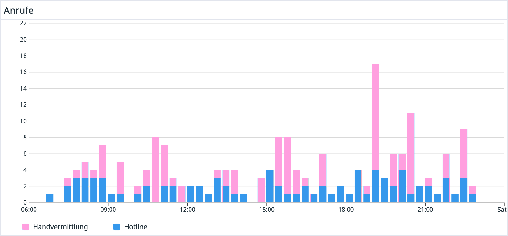

---
title: "Call me by your train: April, April! 📱🤪"
date: 2022-04-02 10:30:00
author: "Das Träwelling Team"
categories: [Bekanntmachungen]
---

_"Willkommen bei Träwelling, was ist dein Support-Code?"_ --- mit diesen Worten haben wir gestern Anrufer\*innen bei Träwelling begrüßt.
Wer es noch [nicht mitbekommen](https://twitter.com/detraxLIVE/status/1510001959687831558) hat: [Das ganze Ding](../call-me-by-your-train) war eine einmalige Aprilscherz-Aktion, die leider nicht fortgeführt wird.

Wir haben aber ein paar Statistiken für euch:
Insgesamt gab es gestern zwischen 7 und 23 Uhr **211&nbsp;Anrufe** an die Nummer, von denen 76 erfolgreich an den menschlichen Support weitergeleitet wurden.
Das Träwelling-Team hat in Summe **2h&nbsp;40min** mit Menschen telefoniert und dabei **60&nbsp;Checkins** generiert.
Außerdem haben wir uns **4&nbsp;GitHub-Issues** für Verbesserungen und Fehler an der Plattform notiert, welche wir in der kommenden Zeit angehen werden.
Im Mittel wurden die Anrufe nach **8&nbsp;Sekunden** entgegengenommen, nur vier Anrufer\*innen haben so schnell wieder aufgelegt, dass sie als "verpasst" in die Statistik zählen.

Zusätzlich dazu gab es 103 Weiterleitungen an das Handvermittlung-System, welches insgesamt **11&nbsp;Checkins** vollautomatisch erstellt hat (uff, da müssten wir nochmal dran, wenn das länger halten sollte 😅).
**18&nbsp;Anrufe** haben unser [Easteregg mit der Tröte](party.wav) gefunden.

Wir hatten unglaublich viel Spaß dabei, euch alle kennenzulernen, neue und altbekannte Stimmen zu hören, und mit euch den Tag zu verbringen.
Danke, dass ihr Träwelling mit Leben füllt und bei solchen Späßen dabei seid.
Allzeit gute Fahrt! ❤️